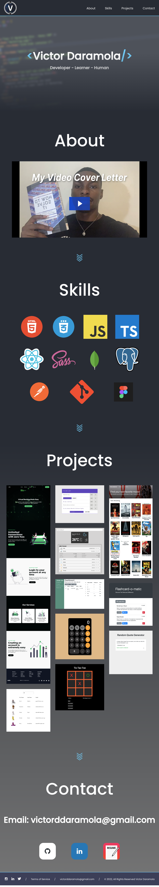
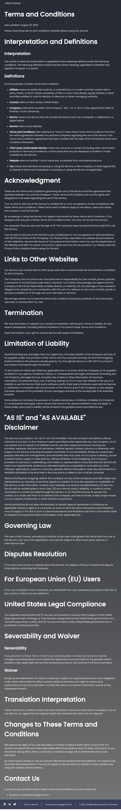
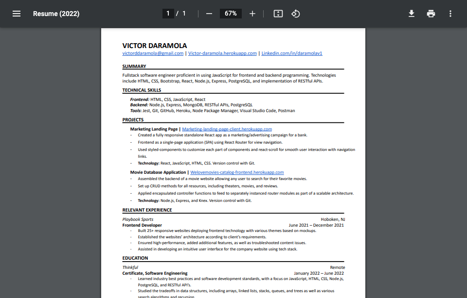

# Project Archive

Project Archive is my online representation of work I have created, as well as my skills and experiences. It includes my resume, a video summary of qualifications and skills, images and links of projects, and more. The thought process in making it was to give more people access to your work and a better idea of your abilities as well as display skills and projects in a robust and visual way that complements the information in your resume and cover letter.

## Links

- [Live Demo](https://victor-daramola.herokuapp.com/)

## Screenshots

### Home Page:

### Terms of Service:

Generic terms of service made so that rights are protected (website does not collect any data whatsoever so this could have been excluded).

### Resume:

Link to my Resume in the contact section.

## Technology

### Built with:

- React, including useState and useEffect, react-scroll

  - Created with [create-react-app](https://github.com/facebook/create-react-app)
